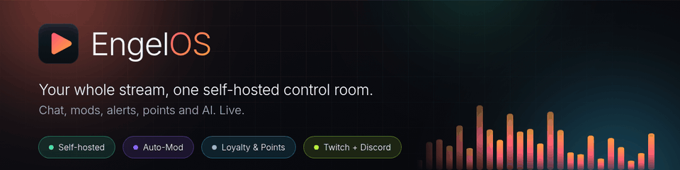

<a id="readme-top"></a>

<div align="center">



<br/>
<br/>

[](https://go.dev)
[](LICENSE)
[](pkg/sdk/LICENSE)
[](#-quick-start)
[](#-project-status)
[](https://github.com/Luca-Pelzer/engelos/stargazers)

<p>
  <a href="#-what-engelos-is">What it is</a>
  &nbsp;·&nbsp;
  <a href="#-product-core">Product core</a>
  &nbsp;·&nbsp;
  <a href="#-quick-start">Quick start</a>
  &nbsp;·&nbsp;
  <a href="#%EF%B8%8F-architecture">Architecture</a>
  &nbsp;·&nbsp;
  <a href="#-project-status">Status</a>
</p>

# EngelOS

**AI-native moderation and workflow automation for streams.**

EngelOS is built around two things: a context-aware **AI-Mod** and a general n8n/SAP-iFlows-like **Workflow Builder** for stream automation and integrations. AI can be used inside workflows, but it is optional. Everything else is core runtime, Twitch-native integration, or plugin.

⭐ **If this looks useful, [star the repo](https://github.com/Luca-Pelzer/engelos)** to follow along and help it grow.

</div>

---

## 🎯 What EngelOS is

EngelOS is an **AI-native stream operator** for Twitch/streaming:

- an AI moderation system that understands context instead of only matching words;
- a visual workflow/command builder where stream events, webhooks, schedules, commands, endpoints, and external services can trigger conditions, transforms, optional AI steps, and actions;
- a plugin platform for optional integrations such as Discord, OBS, TTS, CoHost providers, YouTube, Kick, translation, and overlays;
- a self-hostable Go daemon with an embedded dashboard, plus a planned hosted Cloud version for people who do not want to operate their own server.

EngelOS is **not** trying to clone every Twitch or chatbot feature. If Twitch already owns a feature well — clips, Channel Points, polls, predictions, stream title/category, moderation actions — EngelOS should call the native API and orchestrate it through workflows instead of rebuilding it.

> [!IMPORTANT]
> **Phase 1 alpha.** The daemon is actively dogfooded, but public APIs, database schema, and product surfaces are still being reframed around the AI-Mod + Workflow Builder core.

---

## 🧠 Product core

### 1. AI-Mod

The AI-Mod is the primary wedge.

Target behavior:

```text
chat/event
  -> rules/scam/link fast path
  -> context + viewer/community memory
  -> model router / managed backend / local model
  -> moderation decision
  -> Twitch-native action
  -> audit + feedback
```

What matters:

- fast local rules for obvious spam, scam, links, and policy violations;
- AI escalation only for grey areas where context matters;
- model routing, with a managed Cloud backend as the preferred strong backend path and local/BYOK options where appropriate;
- cautious defaults, shadow/dry-run mode, explanations, and audit logs;
- operator feedback so the mod learns community norms without silently becoming dangerous.

### 2. Workflow Builder

The second main feature is a workflow/command builder in the spirit of n8n, SAP iFlows, or Streamer.bot, but focused on streams and creator operations.

Commands are just one possible trigger. AI is optional. The real model is:

```text
Trigger -> Conditions/Mapping -> Optional AI Step -> HTTP/Webhook/Twitch/Plugin Action -> Audit/Result
```

The builder should be able to call and receive from arbitrary services through HTTP requests, webhooks, endpoints, schedules, credentials, mapping/transforms, branching, retries, approvals, and plugin capabilities — not only Twitch events.

Examples:

- `OnChannelPointRedemption -> AI safety check -> TTS/Discord/Twitch fulfill`;
- `Before stream -> AI.GenerateTitleAndDescription -> operator approval -> Twitch.SetStreamInfo`;
- `Chat spike -> AI score highlight -> Twitch.CreateClip -> AI.GenerateTitle -> Discord.Post`;
- `Suspicious link -> AI-Mod decision -> Delete/Timeout -> audit note`.

### 3. Plugins, not bloat

Optional integrations should be plugins/capabilities, preferably bundled when useful:

- TTS/voice providers;
- external CoHost integrations;
- OBS;
- Discord advanced actions;
- YouTube/Kick adapters;
- translation/summaries;
- overlays, only where they add value beyond native Twitch/OBS;
- import tools such as Moobot migration.

CoHost is deliberately **not** a core feature: a good real-time AI cohost is its own product category. EngelOS should integrate a mature cohost, provide context/permissions/workflows/audit, and avoid owning that entire surface too early.

---

## ✨ What ships today

The current alpha already includes much of the runtime foundation:

- Twitch IRC/Helix/EventSub and Discord integration;
- workspace/auth/RBAC/session infrastructure;
- rule-based moderation, escalation state, audit, dry-run tests;
- contextual/AI moderation scaffolding;
- actions engine, scheduler, registry, and API handlers;
- custom commands, counters, quotes, timers, and legacy bot surfaces;
- Channel Points / redemption plumbing for workflow-style triggers;
- TTS and experimental CoHost code that should become plugins/integrations;
- YouTube/Kick adapters in progress;
- event sourcing, REST API, WebSocket/SSE live transport, embedded Svelte dashboard.

Some older modules are intentionally being reclassified. Economy, mini-games, generic overlays, song requests, and Twitch-feature clones should not be the front-page pitch unless they become useful plugins or workflow templates.

---

## 🚀 Quick start

```bash
git clone https://github.com/Luca-Pelzer/engelos.git
cd engelos

make web-build          # build + embed the dashboard
make build              # builds bin/engelos

# Anonymous/read-only Twitch mode
ENGELOS_TWITCH_CHANNELS=yourchannel ./bin/engelos
```

The daemon listens on `127.0.0.1:8080` by default.

For development:

```bash
make test
make vet
make web-build
```

`make lint` also exists, but requires `golangci-lint` to be installed locally.

---

## ⚙️ Configuration

Configuration is environment-variable based.

| Variable | Meaning |
|---|---|
| `ENGELOS_DATA_DIR` | SQLite data directory. |
| `ENGELOS_ADDR` | HTTP listen address, default `127.0.0.1:8080`. |
| `ENGELOS_TWITCH_CHANNELS` | Comma-separated Twitch channels to join. |
| `ENGELOS_TWITCH_USERNAME` / `ENGELOS_TWITCH_OAUTH` | Authenticated Twitch bot identity. |
| `ENGELOS_TWITCH_CLIENT_ID` / `ENGELOS_TWITCH_CLIENT_SECRET` | Twitch OAuth/API app credentials. |
| `ENGELOS_TWITCH_REDIRECT_URL` | Twitch OAuth callback URL. |
| `ENGELOS_DISCORD_REDIRECT_URL` | Discord OAuth callback URL. |
| `ENGELOS_ALLOWED_ORIGINS` | Dashboard/API origin allowlist. |
| `ENGELOS_SECRETS_KEY` | Enables encrypted OAuth/login storage. |
| `ENGELOS_TRANSLATE_BASE_URL` | Anthropic-compatible AI endpoint. |
| `ENGELOS_ANTHROPIC_API_KEY` | Optional BYOK/API key for compatible AI endpoint. |

> [!NOTE]
> Local/self-hosted should remain useful without Cloud. AI-backed flows can use a BYOK Anthropic-compatible endpoint, local models, or be disabled until configured.

---

## 🏗️ Architecture

```text
EngelOS Daemon (Go)
├── Core runtime
│   ├── Twitch/Discord adapters
│   ├── event dispatcher
│   ├── auth/RBAC/workspaces
│   ├── event sourcing + audit
│   ├── HTTP API + WebSocket/SSE
│   └── embedded dashboard
│
├── Main feature: AI-Mod
│   ├── rules/scam/link fast path
│   ├── context + memory
│   ├── model router / managed backend / local model
│   ├── decision policy
│   └── Twitch-native moderation actions
│
├── Main feature: Workflow Builder
│   ├── triggers
│   ├── conditions
│   ├── mapping/transforms
│   ├── optional AI steps
│   ├── HTTP/webhook/endpoints
│   ├── Twitch-native actions
│   └── plugin actions
│
└── Plugin platform
    ├── TTS/voice
    ├── CoHost integrations
    ├── OBS/overlay when useful
    ├── Discord/YouTube/Kick
    └── import/admin tools
```

---

## ☁️ Self-host and Cloud

The self-hosted build is the real product, not a teaser.

| | Self-hosted | Cloud, planned |
|---|---|---|
| Hosting | Your machine/server | Managed by EngelOS |
| Setup | Local wizard + system checks | AI-guided hosted setup |
| AI | BYOK, local model, or disabled | Managed defaults + managed backend |
| Data | Stays with operator | Managed tenant data |
| Best for | Control, local setups, tinkerers | Streamers who want it to just work |

A shared setup wizard should drive both modes. Cloud can automate more; Local must still be easy through system checks, guided repair, sensible defaults, and optional backend/local model choices.

---

## 📦 Project status

Current state: **Phase 1 alpha / dogfood**.

Recent direction:

- source-of-truth and deploy provenance are being cleaned up;
- GitHub/docs are being reframed around the product core;
- existing modules are being classified into core, workflow nodes, plugins, Twitch-native wrappers, and deprecated/bloat;
- public OSS launch is still planned for a later stable phase, after the core surfaces are coherent.

---

## 🗂️ Repository layout

```text
cmd/engelos/             Daemon entry point and runtime wiring
internal/
  actions/               Workflow/action engine foundation
  adapters/              Platform interfaces and Twitch/YouTube/Kick adapters
  api/                   HTTP router, handlers, middleware, WebSocket hub
  auth/                  Users, sessions, RBAC, OAuth stores
  automod/               Rule-based moderation fast path
  automodstate/          Escalation state and audit storage
  moderation/            Moderation service orchestration
  cohost/                Experimental cohost surface; target: external integration/plugin
  tts/                   Voice/TTS provider integration; target: plugin
  channelpoints/         Twitch-native redemption/action bridge
  redemptions/           Local state around Twitch-native redemptions
  runtime/               Dispatcher and live fan-in
  eventsourcing/         SQLite append-only event log
pkg/sdk/                 Public SDK, Apache-2.0
web/                     Svelte dashboard
```

---

## ⭐ Star the project

EngelOS is built in the open by one person, and a star is the simplest way to help:

- It tells me which features people actually want, so I build the right things next.
- It puts EngelOS in front of more streamers who need better moderation and workflow automation.
- It helps keep a long, ambitious project moving.

If you self-host it, plan to, or just like where it's heading,
**[drop a ⭐ on the repo](https://github.com/Luca-Pelzer/engelos)**. Watch the repo to follow releases,
and open an issue with ideas or bugs.

---

## 🤝 Contributing

EngelOS is not accepting broad community PRs yet because the product surface is still being reframed. Issues and focused discussion are welcome once the public launch phase opens.

If you want to understand where contributions will fit, the public README and the license/SDK docs are the starting point.

---

## 📄 License

- Core daemon: **AGPL-3.0**, see [`LICENSE`](LICENSE)
- SDK (`pkg/sdk/`): **Apache-2.0**, see [`pkg/sdk/LICENSE`](pkg/sdk/LICENSE)

<p align="right">(<a href="#readme-top">back to top</a>)</p>
